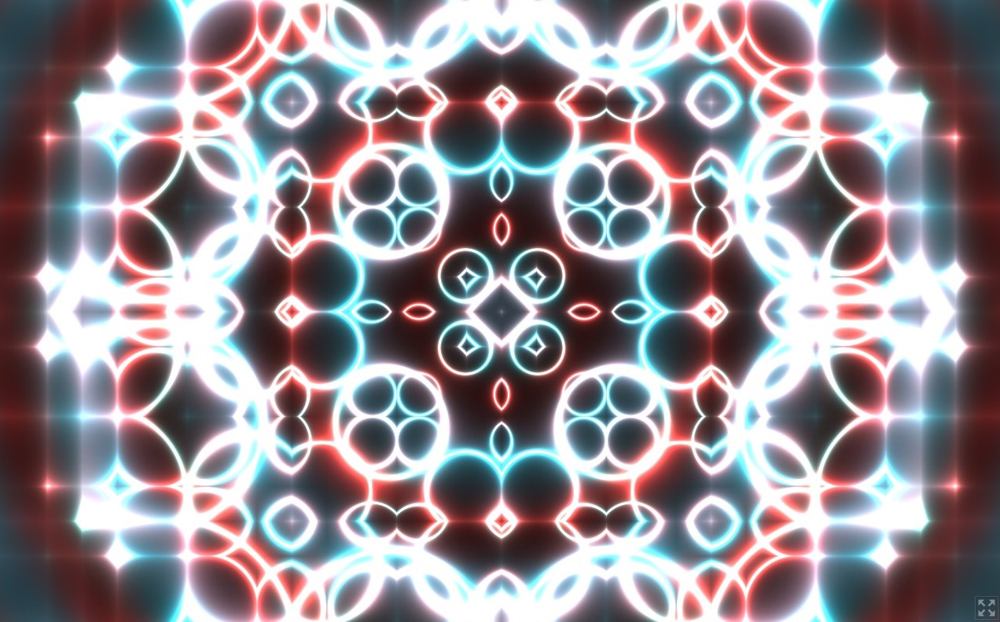

# Kaleidoscope

This is a little experimentation made in Godot.

It is currently deployed on Itch.io [here](https://emberger.itch.io/kaleidoscope) where you can play in your browser. 

Controls are simple:

- Select parameters with arrows left and right ( ← →)

- Increase or decrease their value with arrows up and down (↑ ↓).

This was made following this amazing tutorial by [Kichimisu](https://youtu.be/f4s1h2YETNY) and made it interactive with Godot.
